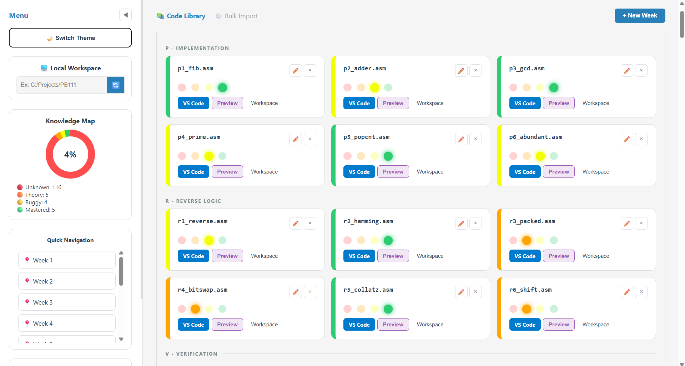

# Code Mastery Assistant (FI MUNI Edition)

This tool was specifically designed for **FI MUNI** students enrolled in courses **PB111**, **IB111**, and **PB152cv** (taught by Petr Ročkaj). The goal is to provide a cleaner, more interactive environment for managing weekly assignments, tracking progress, and working efficiently with code.

## ✨ Key Features

- **📦 Automatic Task Sync:** Simply select your materials folder, and the app automatically loads assignments from folders `00` through `12`.
- **🔗 VS Code Integration:** Open any specific task directly in Visual Studio Code with a single click using a custom protocol.
- **👁️ Live Preview:** Fast source code preview directly in the browser (no need to switch windows).
- **📝 Personalized Workspace:** Each task has its own space for notes or your own implementation, saved locally in your browser.
- **📊 Knowledge Map:** A visual donut chart showing you exactly what percentage of tasks you have truly "mastered."
- **🖱️ Drag & Drop:** Easily reorganize the order of weeks or move tasks between categories (Implementation, Reverse, Verification).
- **🌗 Dark/Light Mode:** Customize the interface based on whether you're coding during the day or pulling an all-nighter in the study room.

## 🛠️ Installation and Setup

This project is built as a static web application, so there is no need to install anything:

1. Download (or `git clone`) this repository.
2. Open the `index.html` file in any modern browser (Chrome or Edge are recommended for File System API support).

## 📖 How to Use It?

### 1. Path Setup (for VS Code)
In the sidebar, enter the full path to your local repository into the **Absolute Path** field (e.g., `PathTo/ PB111/IB111/PB152cv`). This path is saved in your browser so the "VS Code" buttons work correctly.

### 2. Scanning Folders
Click on **🔄 Scan Folders**. The browser will ask for permission to access the folder. Select the main folder of the course. The application will automatically recognize files in subfolders `00`, `01`, etc.

### 3. Tracking Progress
Each task has 4 states (color-coded dots):
- 🔴 **Unknown** (Haven't looked at it yet)
- 🟠 **Theory** (I understand how it works)
- 🟡 **Buggy** (Almost know it)
- 🟢 **Mastered** (I know it better than Rockaj)

## 🧰 Tech Stack

- **Vanilla JS, HTML5, CSS3** (No unnecessary frameworks)
- **Sortable.js** (For intuitive Drag & Drop)
- **Prism.js** (For beautiful code syntax highlighting)
- **File System Access API** (For reading local files)

## 🤝 Contributing

If you are an FI student and have an idea for improvement (e.g., adding checkers or IS MUNI integration), feel free to open an **Issue** or submit a **Pull Request**.

---

**Created to make surviving semesters at FI MUNI a little easier. Good luck with your coding!** 💻🔥